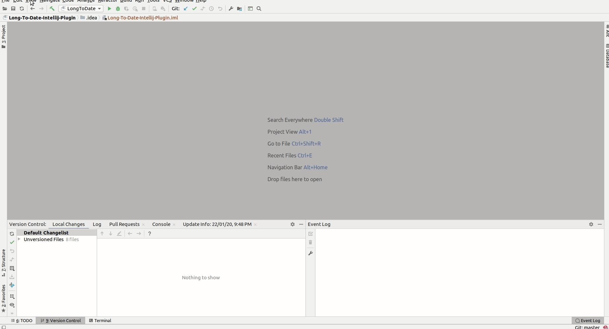
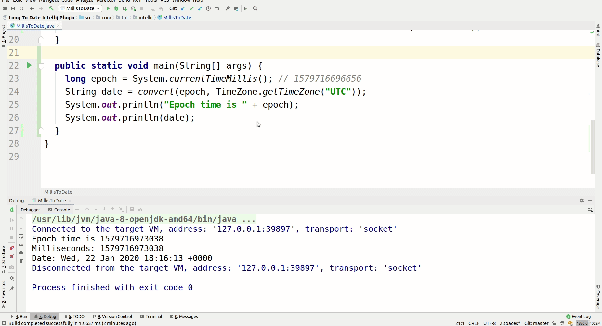
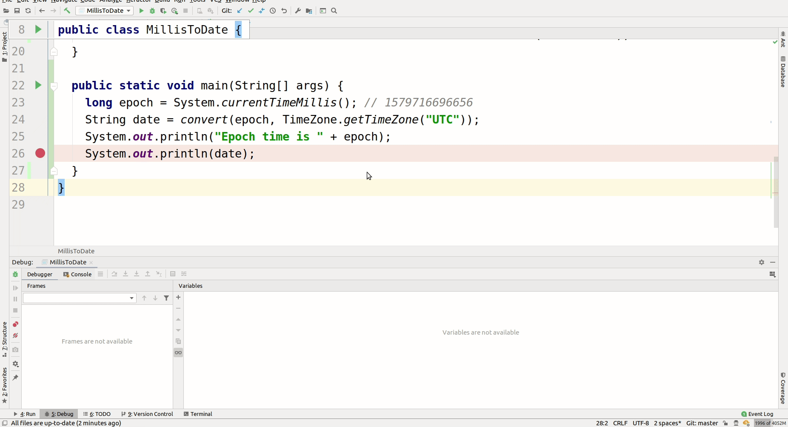

# Long-To-Date-Intellij-Plugin
Intellij-Plugin to convert long epoch milliseconds to date.

### Features
- [x] Convert from Editor.
- [x] Convert from Console.
- [x] Convert from Debugger.
- [ ] Convert from Tools.

### Installation

### Usage from editor

### Usage from From Console

### Usage from From Debugger
